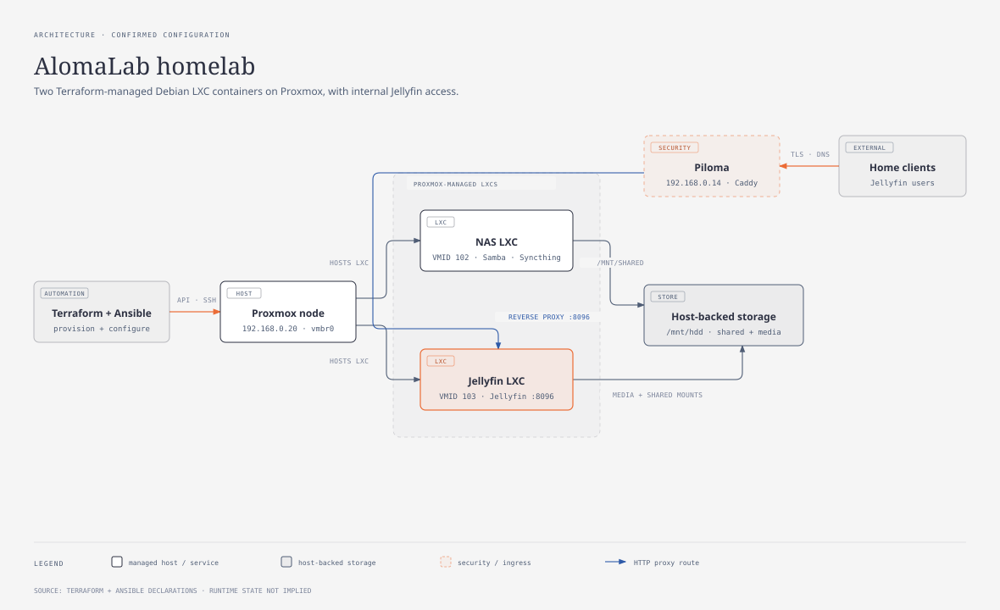

# Architecture

[Open the detailed K3s diagram and evidence notes](architecture-diagram/k3s-architecture.html).
The older homelab overview below supplies the Proxmox/LXC context; the new
figure expands the Kubernetes application path.

The [standalone diagram](architecture-diagram/alomalab-homelab.architecture-redraw.html)
contains the same topology with implementation notes. An
[interactive architecture view](architecture-diagram/alomalab-homelab.architecture.html)
is generated from the tracked
[Archify source](architecture-diagram/alomalab-homelab.architecture.json).

## Current topology

| Component | Address / ID | Repository ownership | Confirmed role |
| --- | --- | --- | --- |
| Proxmox node | `192.168.0.20` | Existing host in Ansible inventory | Runs the Terraform-managed VMs and LXC containers. |
| K3s control plane | VMID `20100`, `192.168.0.200` | Terraform VM; Ansible `server` host | Ubuntu Jammy VM with 2 vCPUs, 2 GiB dedicated memory, 512 MiB floating memory, and a 10 GiB disk. |
| K3s worker 01 | VMID `20101`, `192.168.0.201` | Terraform VM; Ansible `agent` host | Ubuntu Jammy worker with 1 vCPU, 1 GiB dedicated memory, 512 MiB floating memory, and an 8 GiB disk. |
| K3s worker 02 | VMID `20102`, `192.168.0.202` | Terraform VM; Ansible `agent` host | Second worker with the same VM sizing as worker 01. |
| Raspberry Pi reverse proxy (Piloma) | `192.168.0.14` | Existing physical host; Ansible `reverse_proxy` host | Runs Pi-hole DNS and Caddy outside the intended cluster. A retired Pi node record remains NotReady in the live API. |
| NAS LXC | VMID `102`, `192.168.0.102` | Terraform LXC; Ansible `nas` host | Samba and Syncthing target. Proxmox `/mnt/hdd/shared` is mounted at `/mnt/shared`. |
| Jellyfin LXC | VMID `103`, `192.168.0.103` | Terraform LXC; Ansible `jellyfin` host | Jellyfin, optional qBittorrent and Radarr, and Syncthing. It receives writable media/shared bind mounts. |
| Reserved K3s SDN | `k3szone`, `k3svnet`, `vmbr20`, `192.168.20.0/24` | Terraform | Declared Proxmox SDN and bridge. No current K3s VM is attached to it. |

## Kubernetes lifecycle

Terraform downloads the current Ubuntu Jammy cloud image, imports it into the
Proxmox `local` datastore, and creates the control-plane VM plus two worker VMs
on the `proxmox` node. The reusable VM module defaults to the `vmbr0` bridge;
`k3s.tf` assigns the three VMs addresses `192.168.0.200–202/24` with
`192.168.0.1` as their gateway.

Ansible then installs K3s through the Git-sourced `k3s-ansible` collection:

- `k3s-cp-01` is the sole host in `server` and supplies the API endpoint.
- `k3s-worker-01` and `k3s-worker-02` are the hosts in `agent`.
- `setup-k3s.yml` pins `k3s_version` to `v1.36.3+k3s1` and imports
  `k3s.orchestration.site`.

The declared cluster is the control-plane VM and two worker VMs. A read-only
inspection on 2026-09-18 found all three Ready plus a retired `pi-worker-1`
record at `192.168.0.14` marked NotReady. Piloma runs Pi-hole and Caddy outside
the intended cluster. The `kube/glance-dashboard/` directory now supplies
Glance workload, Service, Ingress, and ConfigMap manifests.

The live cluster also contains Argo CD and the K3s CoreDNS, metrics-server,
local-path provisioner, and Traefik deployments. No Argo CD Applications were
present at inspection, so Glance is not documented as GitOps-managed.

`playbooks/k3s/update-debian.yml` targets `k3s_nodes`, a group that does not
exist in the inventory. A syntax check succeeds but Ansible selects no hosts;
the target must be aligned before that maintenance playbook is operational.

## Network and communication

1. Terraform communicates with the configured Proxmox API to create the three
   VMs, two LXC containers, their disks, and the separate SDN resources.
2. Ansible reaches the inventory hosts over SSH. Cluster agents use the control
   plane at `192.168.0.200` as their K3s API endpoint.
3. The active VMs and containers use `vmbr0` on `192.168.0.0/24`. The declared
   `vmbr20`/`192.168.20.0/24` SDN is currently a disconnected reserved path;
   the configuration does not declare routing, DHCP, DNS, or firewall policy
   for it.
4. Caddy on Piloma forwards `jellyfin.alomalab.internal` to
   `192.168.0.103:8096` with `tls internal`. DNS for that name and client trust
   of Caddy's local CA are outside this repository.
5. The NAS and Jellyfin containers consume host-backed bind mounts. Samba
   exposes `/mnt/shared`; Jellyfin receives `/mnt/media`, `/mnt/shared`, and
   `/mnt/media-2`.

## Service configuration boundaries

Ansible can install Jellyfin on port `8096`, qBittorrent-nox on port `8080`,
and Radarr on port `7878`. Only Jellyfin has an Ansible-managed Caddy route
in repository source. The
live Caddyfile additionally contains Proxmox, Pi-hole, and Glance routes. The
qBittorrent playbook currently defaults to `/mnt/hdd/shared/torrents` inside
the LXC, which is not the Terraform bind-mount target `/mnt/shared`; choose an
intentional writable download directory during operation.

The Syncthing playbook creates and starts a separate `syncthing` service on the
NAS and Jellyfin LXCs and waits for each local administration interface on port
`8384`. Device IDs, shared folders, and the relationship between the instances
are not encoded in this repository.

## Documentation automation

The tracked `documentation-agent.yml` workflow runs for qualifying pushes to
`main` and for manual dispatch. It installs Archify, updates the authorized
documentation files, validates/renders the JSON architecture source, and can
publish a documentation branch and pull request using the
`DOCUMENTATION_PR_TOKEN` secret. The diagram-design HTML and SVG are maintained
alongside that interactive artifact for direct README/docs embedding.

## Glance request path and Kubernetes resources

Verified on 2026-09-18 using the repository manifests, read-only Kubernetes
queries, Pi-hole DNS, and Piloma's live Caddyfile. Addresses and Pod placement
are a snapshot, not scheduling or stable-IP guarantees.

1. A LAN client queries Pi-hole on Piloma, `192.168.0.14:53`. DNS resolves a
   hostname; Pi-hole does not proxy browser HTTP traffic.
2. For the Caddy route, `glance.alomalab.internal` must resolve to Piloma
   `192.168.0.14`. Caddy terminates HTTPS on port 443 with `tls internal`.
3. Caddy preserves the HTTP Host and proxies over HTTP to
   `192.168.0.200:32041`, the current Traefik HTTP NodePort. Traefik's
   `kube-system/traefik` LoadBalancer Service also advertises the three VM
   addresses, with Service ports 80/443 and NodePorts 32041/30929.
4. The `glance-dashboard/glance` Ingress selects class `traefik`, matches
   host `glance.alomalab.internal` and path prefix `/`, and references
   Service `glance:8080`.
5. That ClusterIP Service selects `app=glance-dashboard` and targets the
   container port named `http` (8080). EndpointSlice contains two ready Pod
   addresses. This is the logical Service route; Traefik may connect directly
   to the discovered Pod endpoints rather than traverse the ClusterIP.

The Deployment `glance-dashboard` requests two replicas. Its ReplicaSet
maintains the Pods; neither Deployment nor ReplicaSet carries HTTP traffic.
The observed Pods run on `k3s-cp-01` and `k3s-worker-02`. No anti-affinity
or topology-spread rule guarantees this distribution.

| Configuration source | Pod volume | Container mount (read-only) | Files |
| --- | --- | --- | --- |
| ConfigMap `glance-config` | `config` | `/app/config` | `glance.yml`, `home.yml` |
| ConfigMap `glance-assets` | `assets` | `/app/assets` | `user.css` |

Glance includes `home.yml` from its main configuration and serves custom CSS
at URL `/assets/user.css`. Both replicas consume the same ConfigMaps through
separate Pod-local volume projections. No PVC is declared or present in the
Glance namespace. The installed local-path provisioner is not used by Glance.
External feeds require outbound DNS/HTTP(S); no custom egress policy is declared
in this workload. The Compose `.env` and host timezone mount are not represented
in the current Deployment.

## Current operational discrepancies

- **DNS bypasses Caddy:** Pi-hole queried directly at `127.0.0.1` on Piloma
  returned `192.168.0.200` for Glance. The workstation resolver returned the
  same address. Change the local DNS record to `192.168.0.14` to use Caddy.
- **Caddy route works independently of DNS:** HTTP to Traefik with Glance's
  Host returned 200. A forced-host HTTPS request to Caddy returned HTTP/2 200
  with `Via: 1.1 Caddy` when certificate verification was skipped for diagnosis.
  Normal curl on Piloma rejected the internal CA; client trust was not verified.
- **Ansible marker ownership:** the live Glance site is currently between
  `BEGIN/END ANSIBLE MANAGED JELLYFIN`. Move it outside those markers before
  rerunning the Jellyfin playbook, whose block replacement would remove it.
- **Legacy fallback:** Caddy's generic `http://` block still references
  `127.0.0.1:32759`. No listener on 32759 was observed on Piloma. The explicit
  Glance site uses the confirmed remote port 32041 instead.
- **Retired node:** the NotReady `pi-worker-1` record is outside the declared
  inventory. No node cleanup or service changes were performed during this review.

Caddy, Pi-hole records, and Traefik's assigned NodePorts are not managed by the
Glance manifests. Recheck the NodePort if the Traefik Service is recreated.
For exact configuration and verification commands see the
[Glance runbook](../kube/glance-dashboard/README.md).
