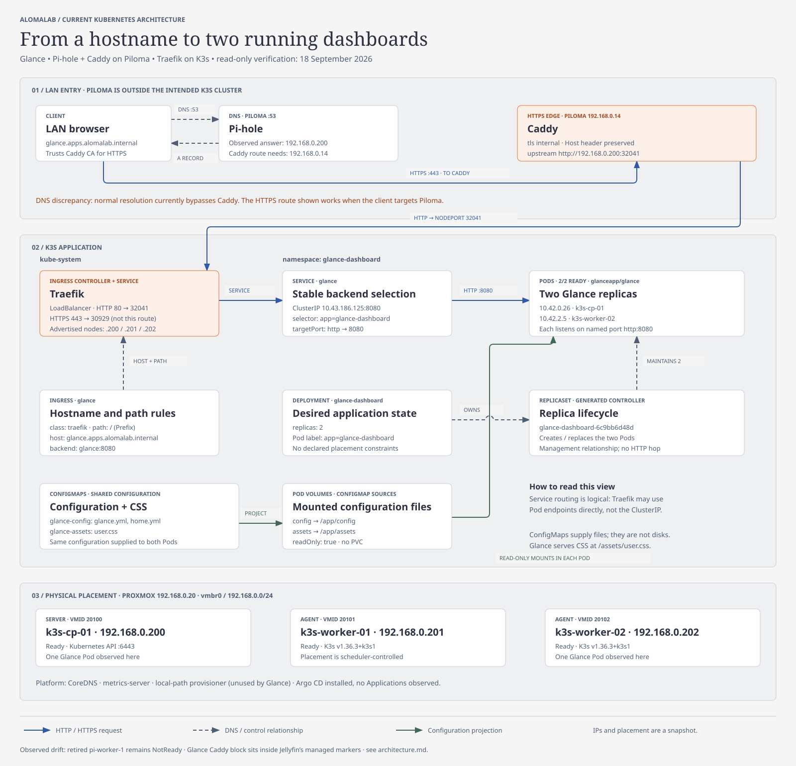

# Glance on K3s

Glance runs as two replicas in namespace `glance-dashboard`. Its stable access
path is Caddy on Piloma → Traefik → the `glance` Service → Glance Pods.



## Apply the workload

From the repository root, using the intended kubectl context:

```bash
kubectl create namespace glance-dashboard --dry-run=client -o yaml | kubectl apply -f -
kubectl apply -n glance-dashboard -f kube/glance-dashboard/configmap.yml
kubectl apply -n glance-dashboard -f kube/glance-dashboard/assets-configmap.yml
kubectl apply -n glance-dashboard -f kube/glance-dashboard/deployment.yml
kubectl apply -n glance-dashboard -f kube/glance-dashboard/ingress.yml
kubectl rollout status -n glance-dashboard deployment/glance-dashboard
```

`deployment.yml` contains both Deployment and Service and omits their namespace;
keep `-n glance-dashboard`. Do not apply the entire directory: it also contains
Compose and Glance configuration YAML, which are not Kubernetes resources.

The Service selects `app=glance-dashboard`; `targetPort: http` resolves to the
container's named port 8080. Ingress `glance` uses class `traefik`, host
`glance.apps.alomalab.internal`, path `/` with `Prefix`, and backend `glance:8080`.
The Deployment creates a ReplicaSet that maintains two Pods. Service routing
selects Pods, not the Deployment or ReplicaSet.

## Edit configuration and assets

Edit files under `config/` or `assets/`, then regenerate from this directory:

```bash
kubectl create configmap glance-config -n glance-dashboard \
  --from-file=glance.yml=./config/glance.yml \
  --from-file=home.yml=./config/home.yml \
  --dry-run=client -o yaml > configmap.yml
kubectl create configmap glance-assets -n glance-dashboard \
  --from-file=user.css=./assets/user.css \
  --dry-run=client -o yaml > assets-configmap.yml
kubectl apply -f configmap.yml -f assets-configmap.yml
kubectl rollout restart deployment/glance-dashboard -n glance-dashboard
kubectl rollout status deployment/glance-dashboard -n glance-dashboard
```

The explicit restart ensures the process rereads configuration. ConfigMap
volume projections update eventually; changing the source files alone does
not update the cluster. Hard-refresh the browser after changing cached CSS.

| ConfigMap | Pod volume | Read-only mount | Keys exposed as files |
| --- | --- | --- | --- |
| `glance-config` | `config` | `/app/config` | `glance.yml`, `home.yml` |
| `glance-assets` | `assets` | `/app/assets` | `user.css` |

These are configuration projections, not persistent disks. No Glance PVC is
used. Keep credentials out of ConfigMaps. The original Compose `.env` and
`/etc/localtime` mounts are not implemented by the current Deployment. The
image is currently unpinned (`glanceapp/glance`), and no probes, resource
requests/limits, or replica-spread constraints are declared.

## Caddy and DNS

Piloma (`192.168.0.14`) runs Caddy and Pi-hole. The verified Caddy site is:

```caddyfile
glance.apps.alomalab.internal {
    tls internal
    reverse_proxy http://192.168.0.200:32041
}
```

Keep this site **outside** `BEGIN/END ANSIBLE MANAGED JELLYFIN`. It was found
inside those markers on 2026-09-18; rerunning the Jellyfin playbook would
replace that region and remove Glance's site.

For Caddy access, configure Pi-hole's local DNS record:

```text
glance.apps.alomalab.internal → 192.168.0.14
```

The observed answer was still `192.168.0.200`, which bypasses Caddy. Pi-hole
only answers DNS; the browser then connects directly to the returned address.
Caddy handles HTTPS with its internal CA; browsers must trust that CA. The
Caddy-to-Traefik hop is HTTP and preserves the requested hostname. No TLS
Secret is required in this Glance Ingress for this arrangement.

On Piloma, after intentionally editing its Caddyfile:

```bash
sudo caddy validate --config /etc/caddy/Caddyfile --adapter caddyfile
sudo systemctl reload caddy
```

Port `32041` is the currently observed Traefik HTTP NodePort, not a value
pinned in this repository. Recheck after recreating the Traefik Service:

```bash
kubectl get svc traefik -n kube-system
```

Do not substitute Caddy's legacy `127.0.0.1:32759` fallback: no listener was
observed there, and Piloma is outside the intended three-VM K3s cluster.

## Verify each hop

```bash
# DNS must return Piloma for the Caddy path.
dig @192.168.0.14 glance.apps.alomalab.internal +short

# Isolate Traefik + Glance, independent of DNS and Caddy.
curl -I -H 'Host: glance.apps.alomalab.internal' http://192.168.0.200:32041

# Isolate Caddy routing; requires trust of Caddy's internal CA.
curl -I --resolve glance.apps.alomalab.internal:443:192.168.0.14 \
  https://glance.apps.alomalab.internal

kubectl get ingress,svc,pods -n glance-dashboard -o wide
kubectl get endpointslices -n glance-dashboard \
  -l kubernetes.io/service-name=glance
kubectl logs deployment/glance-dashboard -n glance-dashboard
```

Both the direct Traefik request and Caddy request returned 200 during review,
but the latter required diagnostic `-k`; CA trust was not confirmed. Use a
trusted root certificate for normal access. A Traefik 404 usually means the
Host/path rule did not match; Caddy 502 suggests the upstream is unreachable.

The cluster contains Argo CD, but no Applications were present at inspection.
These manifests are currently applied directly, with no verified GitOps owner.
See [the full architecture notes](../../docs/architecture.md) for the live
snapshot and remaining operational discrepancies.
